# Общее описание проекта

Создать программную систему, предназначенную для администратора альпинистского клуба. Альпинистский клуб организует восхождения в разных точках мира. Система должна обеспечить сохранение информации о хронике восхождений.
Для каждого восхождения формируется группа. В состав группы могут входить альпинисты из других клубов. Поэтому нужно иметь информацию о каждом клубе (название, страна, город, контактное лицо, e-mail, телефон). Необходимо иметь описание маршрута и продолжительность восхождения. Необходимо обеспечить сохранение даты/времени начала и завершения каж-дого восхождения (планируемого и фактического), имен и адресов участво-вавших в нем альпинистов, названия и высоты горы, страны и района, где эта гора расположена. После завершения восхождения фиксируется информация об успешности восхождения для каждого участника и группы в целом. При возникновении нештатных ситуаций необходимо указать для каждого участ-ника, что случилось (травма, пропал без вести, летальный исход и т.д.) и в пояснении о группе дать подробности.
Администратор должен иметь возможность:
– добавления сведений о новом альпинисте, новой вершине;
– изменении сведений об альпинистах и вершинах;
– формирования новых групп и внесения всей информации после завер-шения восхождения группой.

# Инфологическая модель данных и описание таблиц

## Модель данных:

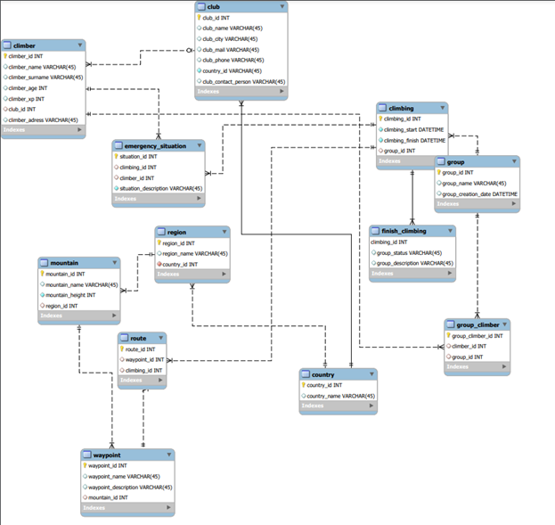

## Описание таблиц

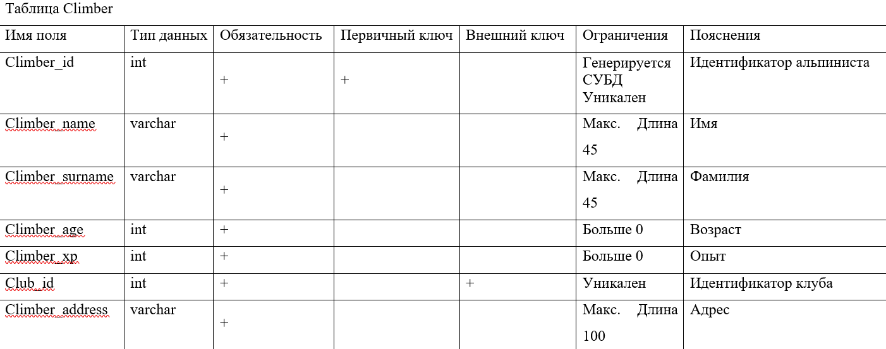

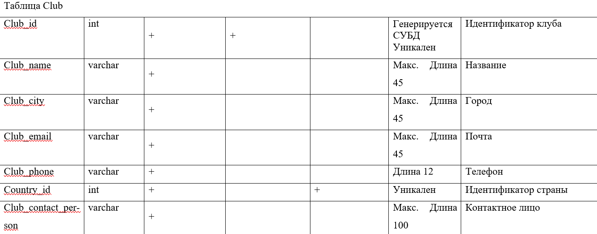

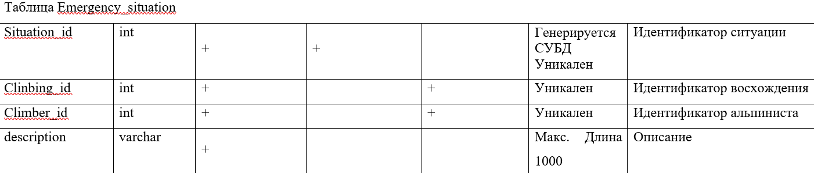

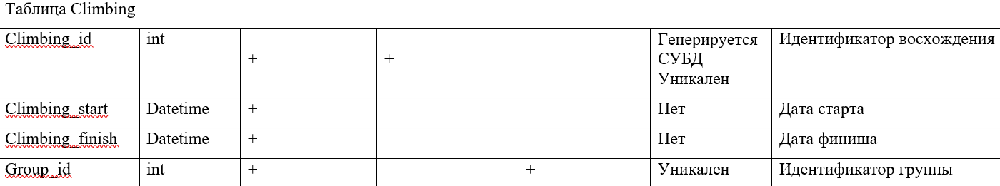

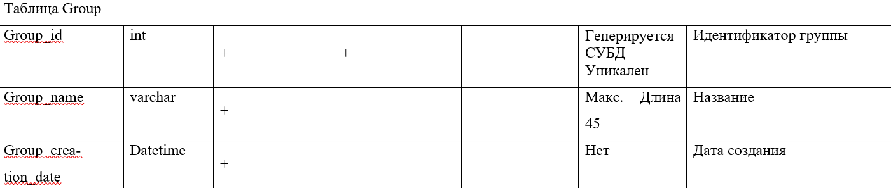

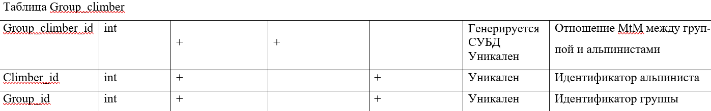

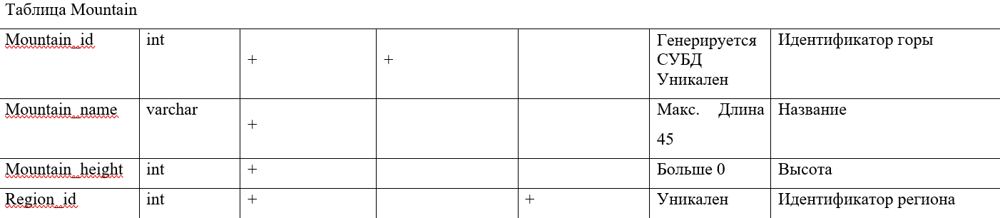

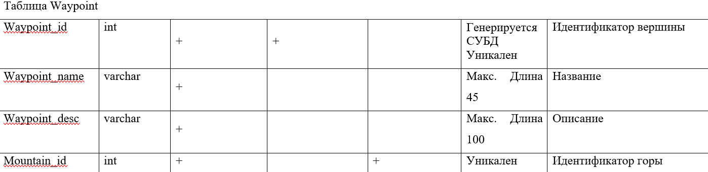

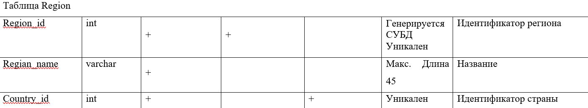

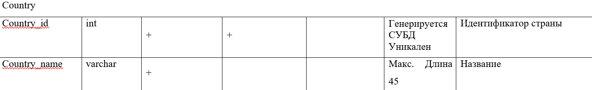

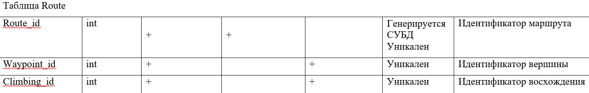

# Код создания модели данных

```
from datetime import datetime

import django
from django.db import models


class Club(models.Model):
    club_id = models.AutoField(primary_key=True, unique=True)
    club_name = models.CharField(max_length=75, verbose_name="Название", unique=True)
    club_city = models.CharField(max_length=100, verbose_name="Город")
    club_mail = models.EmailField(max_length=75, verbose_name="Почта")
    club_phone = models.CharField(max_length=12, verbose_name="Телефон")
    country = models.CharField(max_length=75, verbose_name="Страна")
    club_contact_person = models.CharField(max_length=75, verbose_name="Контакт")

    def __str__(self):
        return self.club_name


class Climber(models.Model):
    climber_id = models.AutoField(primary_key=True, unique=True)
    climber_name = models.CharField(max_length=75, verbose_name="Имя")
    climber_surname = models.CharField(max_length=100, verbose_name="Фамилия")
    climber_age = models.IntegerField(verbose_name="Возраст")
    climber_xp = models.IntegerField(verbose_name="Опыт")
    club_id = models.ForeignKey(Club, on_delete=models.CASCADE, verbose_name="Клуб")
    climber_address = models.CharField(max_length=100, verbose_name="Адрес")

    def __str__(self):
        return self.climber_name + " " + self.climber_surname


class Group(models.Model):
    group_id = models.AutoField(primary_key=True, unique=True)
    group_name = models.CharField(max_length=75, verbose_name="Название")
    group_creation_date = models.DateField(max_length=100, verbose_name="Дата создания", default=django.utils.timezone.now)
    climber = models.ManyToManyField(Climber, verbose_name="Участники", related_name="climbers")
    emergency = models.ManyToManyField("EmergencySituation", verbose_name="Нештатные ситуации", null=True)

    def __str__(self):
        return self.group_name


class Climbing(models.Model):

    STATUS = (("Планируется", "Планируется"),
              ("Выполняется", "Выполняется"),
              ("Завершен", "Завершен"))

    climbing_id = models.AutoField(primary_key=True, unique=True)
    climbing_start = models.DateField(verbose_name="Старт")
    climbing_finish = models.DateField(verbose_name="Финиш")
    group_id = models.ForeignKey(Group, verbose_name="Группа", on_delete=models.CASCADE)
    waypoint = models.ForeignKey("Waypoint", verbose_name="Вершина", on_delete=models.CASCADE)
    status = models.CharField(max_length=20, verbose_name='Статус', choices=STATUS, default="Планируется")


class Mountain(models.Model):
    mountain_id = models.AutoField(primary_key=True, unique=True)
    mountain_name = models.CharField(max_length=75, verbose_name="Название горы")
    mountain_high = models.DecimalField(max_digits=12, verbose_name="Высота горы", decimal_places=2)
    country = models.CharField(max_length=75, verbose_name="Срана")

    def __str__(self):
        return self.mountain_name


class Waypoint(models.Model):
    waypoint_id = models.AutoField(primary_key=True, unique=True)
    waypoint_name = models.CharField(max_length=75, verbose_name="Название вершины")
    waypoint_desc = models.CharField(max_length=200, verbose_name="Описание")
    mountain = models.ForeignKey(Mountain, on_delete=models.CASCADE, verbose_name="Гора")

    def __str__(self):
        return self.waypoint_name


class EmergencySituation(models.Model):
    emergency_id = models.AutoField(primary_key=True, unique=True)
    desc = models.TextField(verbose_name="Описание")
    climber = models.ForeignKey(Climber, on_delete=models.CASCADE, verbose_name="Альпинист")
```

